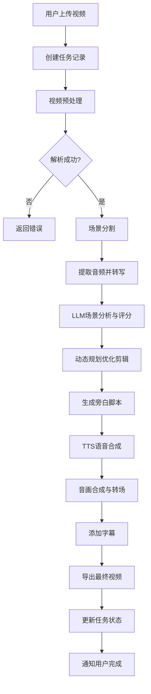

# CineSynopsis - 技术架构文档

## 1. 架构概览

```
┌─────────────────────────────────────────────────────────────────────────┐
│                          前端展示层 (React + TypeScript)                 │
│  ┌───────────────────────────────────────────────────────────────────┐  │
│  │  VideoUploader      ScenePreview     TaskQueue      ExportPanel   │  │
│  │  (视频上传)          (场景预览)       (任务队列)      (导出面板)    │  │
│  └───────────────────────────────────────────────────────────────────┘  │
└────────────────────────────────────────────┬────────────────────────────┘
                                            │ HTTP/REST API
┌────────────────────────────────────────────▼────────────────────────────┐
│                         后端服务层 (FastAPI)                           │
│  ┌──────────────┐  ┌──────────────┐  ┌──────────────┐  ┌──────────────┐ │
│  │  VideoRouter │  │  SceneRouter │  │  TaskRouter  │  │  ExportRouter│ │
│  │  (视频路由)  │  │  (场景路由)  │  │  (任务路由)  │  │  (导出路由)  │ │
│  └──────────────┘  └──────────────┘  └──────────────┘  └──────────────┘ │
│                              │                                         │
│  ┌───────────────────────────────────────────────────────────────────┐  │
│  │                    Business Logic Layer                          │  │
│  │  ┌──────────┐ ┌──────────┐ ┌──────────┐ ┌──────────┐ ┌──────────┐ │ │
│  │  │VideoProc │ │SceneAnal │ │ClipOpt   │ │Narration │ │AudioSync │ │ │
│  │  │(视频处理) │ │(场景分析) │ │(剪辑优化) │ │(旁白生成) │ │(音画同步) │ │ │
│  │  └──────────┘ └──────────┘ └──────────┘ └──────────┘ └──────────┘ │ │
│  └───────────────────────────────────────────────────────────────────┘  │
└────────────────────────────────────┬───────────────────────────────────┘
                                    │
┌────────────────────────────────────▼───────────────────────────────────┐
│                           AI模型层                                    │
│  ┌─────────────────────────────────────────────────────────────────┐   │
│  │  LLM Service    Whisper ASR    TTS Engine    CV Model          │   │
│  │  (剧情分析)     (语音识别)      (语音合成)     (场景分割)       │   │
│  └─────────────────────────────────────────────────────────────────┘   │
└────────────────────────────────────┬───────────────────────────────────┘
                                    │
┌────────────────────────────────────▼───────────────────────────────────┐
│                           基础设施层                                  │
│  ┌──────────┐  ┌──────────┐  ┌──────────┐  ┌──────────┐  ┌──────────┐ │
│  │  FFmpeg  │  │  Redis   │  │  SQLite  │  │  FileSys │  │  Celery  │ │
│  │  (视频处理)│  │(任务队列)│  │(数据库) │  │(文件存储)│  │(异步任务)│ │
│  └──────────┘  └──────────┘  └──────────┘  └──────────┘  └──────────┘ │
└─────────────────────────────────────────────────────────────────────────┘
```

## 2. 技术选型

| 分类 | 技术 | 版本 | 选型理由 |
|------|------|------|----------|
| 前端框架 | React | 18+ | 成熟稳定，生态完善，适合构建复杂UI |
| 前端语言 | TypeScript | 5+ | 类型安全，提升开发效率和代码质量 |
| 状态管理 | Redux Toolkit | 2+ | 集中状态管理，便于处理异步任务 |
| UI组件 | Material UI | 5+ | 丰富的组件库，美观且响应式 |
| 后端框架 | FastAPI | 0.100+ | 高性能，自动生成API文档 |
| 数据库 | SQLite | 3+ | 轻量级，适合单机部署和原型开发 |
| 任务队列 | Redis + Celery | 7+ | 成熟的异步任务处理方案 |
| 视频处理 | FFmpeg | 6+ | 业界标准，支持多种格式和滤镜 |
| AI服务 | OpenAI API | - | 强大的LLM能力，支持语音转文字和合成 |
| 场景分割 | PySceneDetect | 0.6+ | 开源场景检测库，支持多种检测算法 |

## 3. 模块划分

### 3.1 前端模块

| 模块 | 职责 | 关键组件 |
|------|------|----------|
| VideoUploader | 视频文件上传和参数配置 | UploadButton, DurationSelector, SubtitleOptions |
| ScenePreview | 场景列表展示和预览 | SceneList, TimelinePlayer, SceneCard |
| TaskQueue | 批量任务管理 | TaskList, ProgressBar, CancelButton |
| ExportPanel | 导出格式配置和下载 | FormatSelector, ResolutionSelector, DownloadButton |
| App | 主应用布局和状态管理 | AppLayout, Header, Sidebar |

### 3.2 后端模块

| 模块 | 职责 | 核心类/函数 |
|------|------|-------------|
| video_processor | 视频文件解析和预处理 | VideoInfo, extract_frames(), get_audio() |
| scene_analyzer | 场景分割和重要性评分 | Scene, analyze_scenes(), score_scene_importance() |
| clip_optimizer | 动态规划剪辑序列优化 | ClipSequence, optimize_clips() |
| narration_engine | 旁白文本生成和语音合成 | Narration, generate_script(), synthesize_speech() |
| audio_synchronizer | 音画合成和转场处理 | sync_audio_video(), add_transitions() |
| task_manager | 异步任务管理 | Task, create_task(), get_task_status() |

### 3.3 AI模型层

| 服务 | 功能 | 调用方式 |
|------|------|----------|
| LLM Service | 剧情分析、场景评分、旁白脚本生成 | REST API (OpenAI/GPT-4) |
| Whisper ASR | 语音识别，提取对话内容 | 本地/API |
| TTS Engine | 语音合成，生成旁白音频 | REST API (OpenAI TTS) |
| CV Model | 场景分割、帧分析 | PySceneDetect + 自定义模型 |

## 4. API 设计

### 4.1 视频处理 API

| 端点 | 方法 | 功能 | 请求体 | 响应体 |
|------|------|------|--------|--------|
| `/api/videos/` | POST | 上传视频并创建任务 | `file`, `target_duration`, `subtitle_option` | `task_id`, `video_info` |
| `/api/videos/{video_id}/info` | GET | 获取视频信息 | - | `duration`, `fps`, `resolution`, `format` |
| `/api/videos/{video_id}/scenes` | GET | 获取场景列表 | - | `scenes[]` (id, start_time, end_time, score, type) |

### 4.2 任务管理 API

| 端点 | 方法 | 功能 | 请求体 | 响应体 |
|------|------|------|--------|--------|
| `/api/tasks/` | GET | 获取任务列表 | `status` (可选) | `tasks[]` |
| `/api/tasks/{task_id}` | GET | 获取任务状态 | - | `status`, `progress`, `result` |
| `/api/tasks/{task_id}` | DELETE | 取消任务 | - | `success` |
| `/api/tasks/batch` | POST | 批量创建任务 | `videos[]` | `task_ids[]` |

### 4.3 导出 API

| 端点 | 方法 | 功能 | 请求体 | 响应体 |
|------|------|------|--------|--------|
| `/api/export/{task_id}` | POST | 导出视频 | `format`, `resolution`, `bitrate` | `download_url` |
| `/api/export/{task_id}/project` | GET | 下载项目文件 | - | `project.json` |

## 5. 数据库设计

### 5.1 表结构

#### videos 表
| 字段 | 类型 | 约束 | 说明 |
|------|------|------|------|
| id | INTEGER | PRIMARY KEY | 视频ID |
| filename | TEXT | NOT NULL | 原始文件名 |
| filepath | TEXT | NOT NULL | 存储路径 |
| duration | REAL | NOT NULL | 视频时长(秒) |
| fps | REAL | | 帧率 |
| width | INTEGER | | 宽度 |
| height | INTEGER | | 高度 |
| format | TEXT | | 格式 |
| created_at | TIMESTAMP | DEFAULT CURRENT_TIMESTAMP | 创建时间 |

#### scenes 表
| 字段 | 类型 | 约束 | 说明 |
|------|------|------|------|
| id | INTEGER | PRIMARY KEY | 场景ID |
| video_id | INTEGER | FOREIGN KEY | 关联视频 |
| start_time | REAL | NOT NULL | 开始时间(秒) |
| end_time | REAL | NOT NULL | 结束时间(秒) |
| score | REAL | NOT NULL | 重要性评分(0-1) |
| scene_type | TEXT | | 场景类型(key_event/climax/transition) |
| description | TEXT | | LLM生成的场景描述 |

#### tasks 表
| 字段 | 类型 | 约束 | 说明 |
|------|------|------|------|
| id | TEXT | PRIMARY KEY | 任务ID(UUID) |
| video_id | INTEGER | FOREIGN KEY | 关联视频 |
| status | TEXT | NOT NULL | 状态(pending/processing/completed/failed) |
| progress | INTEGER | DEFAULT 0 | 进度(0-100) |
| target_duration | INTEGER | NOT NULL | 目标时长(秒) |
| subtitle_option | TEXT | | 字幕选项 |
| result_path | TEXT | | 结果文件路径 |
| error_message | TEXT | | 错误信息 |
| created_at | TIMESTAMP | DEFAULT CURRENT_TIMESTAMP | 创建时间 |
| updated_at | TIMESTAMP | DEFAULT CURRENT_TIMESTAMP | 更新时间 |

## 6. 核心业务流程

### 6.1 单视频处理流程



### 6.2 场景评分算法

| 场景类型 | 权重 | 说明 |
|----------|------|------|
| 关键事件 | 1.0 | 强制保留（转折、冲突、揭示） |
| 高潮 | 1.0 | 强制保留（影片高潮部分） |
| 结局 | 1.0 | 强制保留（结尾部分） |
| 人物介绍 | 0.8 | 重要人物首次出场 |
| 对话密集 | 0.6 | 信息量高的对话场景 |
| 动作场景 | 0.5 | 动作戏 |
| 过渡 | 0.3 | 日常/氛围镜头 |
| 空镜头 | 0.1 | 纯环境描写 |

### 6.3 动态规划剪辑优化

目标函数：最大化总场景权重，同时满足时长约束

```
max Σ(score_i * selected_i)
s.t. Σ(duration_i * selected_i) ≤ target_duration
selected_i ∈ {0, 1} 且场景顺序保持不变
```

## 7. 安全与权限

- 文件上传限制：最大5GB，仅允许视频格式
- 任务超时处理：单个任务最大处理时间2小时
- 错误日志：记录所有处理错误，便于排查
- 输出文件清理：临时文件定期清理

## 8. 部署方案

### 8.1 开发环境

```bash
# 后端启动
cd backend
pip install -r requirements.txt
uvicorn main:app --reload

# 前端启动
cd frontend
npm install
npm run dev
```

### 8.2 生产环境

- 使用 Docker Compose 部署
- Nginx 反向代理
- Redis 作为缓存和任务队列
- SQLite 作为数据库（可扩展为 PostgreSQL）

## 9. 性能优化

- 视频处理使用 FFmpeg 硬件加速
- 帧提取采用多线程并行处理
- 大文件分片上传
- 结果文件缓存
- 异步任务并行执行（限制并发数）
